# Mapper — Internal Call Graph

Traces the public API down to the key internal helpers. Update this whenever
methods are added, renamed, or the call structure changes (see agents.md).

The graph uses four visual styles:
- **Rounded box** — public API (interface implementations)
- **Sharp box** — internal helpers
- **Stadium/pill** — shared state stores
- **Dashed border** — background thread / async path

```mermaid
flowchart TD

    %% ----------------------------------------------------------------
    %% Public API
    %% ----------------------------------------------------------------
    subgraph pub["Public API"]
        direction TB
        INIT(["`**initialize()**`"])
        SPIN(["`**spinOnce()**`"])
        RESET(["`**reset()**`"])
        ON_OBS(["`**onNewObservation()**`"])
        FPOSE(["`**fuse_pose()**`"])
        FTWIST(["`**fuse_twist()**`"])
        REQ_KF(["`**requestInsertKeyframe()**`"])
        EST_NAV(["`**estimated_navstate()**`"])
        HAS_CVG(["`**has_converged_localization()**`"])
        CUR_GEO(["`**current_georeferencing()**`"])
        GET_DIAG(["`**getDiagnostics()**`"])
    end

    %% ----------------------------------------------------------------
    %% Lifecycle internals
    %% ----------------------------------------------------------------
    subgraph lc["Lifecycle"]
        direction TB
        STOP_THR["stop_optimizer_thread()"]
        REINIT["reinitialize_gtsam_locked()"]
        RST_ANCHORS["reset_sensor_anchors_locked()"]
        SAVE_TUM["saveEstimatedTrajectoryToFile()"]
    end

    %% ----------------------------------------------------------------
    %% Sensor fusion (all called under stateMutex_)
    %% ----------------------------------------------------------------
    subgraph fusion["Sensor Fusion (stateMutex_)"]
        direction TB
        F_POSE_LK["fuse_pose_locked()"]
        F_ODOM["fuse_odometry()"]
        F_IMU["fuse_imu()"]
        F_GNSS["fuse_gnss()"]
        ACCUM_IMU["accumulate_imu_sample_locked()"]
        BUILD_IMU["build_summarized_imu_locked()"]
        APPLY_IMU["apply_imu_observation_locked()"]
        GRAV_FILT["ImuGravityFilter (pool/filter raw IMU)"]
        EMIT_GRAV["emit_filtered_gravity_factor_locked()"]
    end

    %% ----------------------------------------------------------------
    %% Keyframe graph (all called under stateMutex_)
    %% ----------------------------------------------------------------
    subgraph graph["Keyframe Graph (stateMutex_)"]
        direction TB
        REQ_KF_LK["request_insert_keyframe_locked()"]
        CREATE_KF["create_or_get_keyframe_by_timestamp_locked()"]
        INIT_FRAME["initialize_new_frame()"]
        LINK_CHAIN["link_into_odometry_chain_locked()"]
        ADD_EDGE["add_odom_chain_edge_locked()"]
        ADD_KIN["add_kinematic_factor_between()"]
        FIND_NEAR["find_nearest_kf_locked()"]
        SENSOR_ALLOWED["sensor_kf_creation_allowed()"]
    end

    %% ----------------------------------------------------------------
    %% Background optimizer (solve_mutex_; brief stateMutex_ for A + C)
    %% ----------------------------------------------------------------
    subgraph opt["Background Optimizer (solve_mutex_)"]
        direction TB
        OPT_LOOP[["optimizer_thread_loop()\n(background thread)"]]
        NOTIFY["notify_optimizer()"]
        OPT_REFRESH["optimize_and_refresh()\nPhase A: snap pending (brief stateMutex_)\nPhase B: iSAM2 update+estimate (no stateMutex_)\nPhase C: commit caches (brief stateMutex_)"]
    end

    %% ----------------------------------------------------------------
    %% Shared state stores
    %% ----------------------------------------------------------------
    GTSAM_PEND(["state_.gtsam\npending factors + values"])
    CACHE_POSES(["last_estimated_states\ncached poses · twists · covs"])
    GEO_REF(["state_.geo_reference\nT_enu_to_map + geo_coord"])

    %% ----------------------------------------------------------------
    %% Spinonce
    %% ----------------------------------------------------------------
    SPIN --> PUB_POSE["publish_high_rate_pose()"]
    SPIN --> VIZ["updateVisualization()\n(Mapper_GUI.cpp)"]
    PUB_POSE --> FRESH_STAMP["get_current_extrapolated_stamp_locked()"]
    PUB_POSE --> EST_NAV
    VIZ --> FRESH_STAMP
    VIZ -->|camera follow| EST_NAV

    %% ----------------------------------------------------------------
    %% initialize
    %% ----------------------------------------------------------------
    INIT --> STOP_THR
    INIT --> REINIT
    INIT --> RST_ANCHORS
    INIT --> OPT_LOOP

    %% ----------------------------------------------------------------
    %% reset
    %% ----------------------------------------------------------------
    RESET --> RST_ANCHORS

    %% ----------------------------------------------------------------
    %% onNewObservation dispatch
    %% ----------------------------------------------------------------
    ON_OBS -->|"CObservationOdometry"| F_ODOM
    ON_OBS -->|"CObservationIMU"| F_IMU
    ON_OBS -->|"CObservationGPS"| F_GNSS

    %% ----------------------------------------------------------------
    %% fuse_pose
    %% ----------------------------------------------------------------
    FPOSE --> F_POSE_LK
    FPOSE --> NOTIFY
    F_POSE_LK --> SENSOR_ALLOWED
    F_POSE_LK -->|"ref frame: PriorFactor"| CREATE_KF
    F_POSE_LK -->|"odom frame + kf allowed"| CREATE_KF
    F_POSE_LK -->|"odom frame + kf allowed"| LINK_CHAIN
    F_POSE_LK --> GTSAM_PEND

    %% ----------------------------------------------------------------
    %% fuse_odometry  (aggregate=false: calls fuse_pose_locked;
    %%                 aggregate=true: builds BetweenFactor directly)
    %% ----------------------------------------------------------------
    F_ODOM --> SENSOR_ALLOWED
    F_ODOM -->|"non-aggregate path"| F_POSE_LK
    F_ODOM -->|"aggregate path"| CREATE_KF
    F_ODOM -->|"aggregate path"| GTSAM_PEND
    F_ODOM --> NOTIFY

    %% ----------------------------------------------------------------
    %% fuse_imu  (Path A: rate-cap; Path B: direct)
    %% ----------------------------------------------------------------
    F_IMU -->|"filtered gravity: feed raw"| GRAV_FILT
    GRAV_FILT -->|"window ready: 1 earned-sigma factor"| EMIT_GRAV
    EMIT_GRAV -->|"kf allowed"| CREATE_KF
    EMIT_GRAV -->|"SharedMapOnly"| FIND_NEAR
    EMIT_GRAV --> GTSAM_PEND
    F_IMU -->|"Path A: accumulate"| ACCUM_IMU
    F_IMU -->|"Path A: build summary"| BUILD_IMU
    F_IMU -->|"both paths (attitude/gyro; legacy gravity)"| APPLY_IMU
    APPLY_IMU --> SENSOR_ALLOWED
    APPLY_IMU -->|"kf allowed"| CREATE_KF
    APPLY_IMU -->|"SharedMapOnly"| FIND_NEAR
    APPLY_IMU --> GTSAM_PEND
    F_IMU --> NOTIFY

    %% ----------------------------------------------------------------
    %% fuse_gnss
    %% ----------------------------------------------------------------
    F_GNSS --> SENSOR_ALLOWED
    F_GNSS -->|"kf allowed"| CREATE_KF
    F_GNSS -->|"SharedMapOnly"| FIND_NEAR
    F_GNSS -->|"FactorGnssMapEnu"| GTSAM_PEND
    F_GNSS --> NOTIFY

    %% ----------------------------------------------------------------
    %% requestInsertKeyframe  (SharedKeyframeMap sink, e.g. LIO)
    %% ----------------------------------------------------------------
    REQ_KF --> REQ_KF_LK
    REQ_KF --> NOTIFY
    REQ_KF_LK --> CREATE_KF
    REQ_KF_LK --> LINK_CHAIN
    REQ_KF_LK -->|"wheel edge if prev KF"| GTSAM_PEND

    %% ----------------------------------------------------------------
    %% KF graph helpers
    %% ----------------------------------------------------------------
    CREATE_KF --> INIT_FRAME
    INIT_FRAME --> ADD_KIN
    ADD_KIN --> GTSAM_PEND
    LINK_CHAIN --> ADD_EDGE
    ADD_EDGE --> GTSAM_PEND

    %% ----------------------------------------------------------------
    %% Optimizer
    %% ----------------------------------------------------------------
    NOTIFY --> OPT_LOOP
    OPT_LOOP --> OPT_REFRESH
    OPT_REFRESH -->|"Phase A: drain"| GTSAM_PEND
    OPT_REFRESH -->|"Phase C: commit"| CACHE_POSES
    OPT_REFRESH -->|"Phase C: convergence-gated"| GEO_REF

    %% ----------------------------------------------------------------
    %% Query paths (estimated_navstate, convergence, geo-ref)
    %% ----------------------------------------------------------------
    EST_NAV -->|"sync mode only"| OPT_REFRESH
    EST_NAV --> CACHE_POSES
    HAS_CVG --> GEO_REF
    CUR_GEO --> GEO_REF

    %% ----------------------------------------------------------------
    %% Teardown
    %% ----------------------------------------------------------------
    GET_DIAG --> CACHE_POSES
    GET_DIAG --> GEO_REF
    FTWIST --> GTSAM_PEND
    FTWIST --> NOTIFY

    %% ----------------------------------------------------------------
    %% Styling
    %% ----------------------------------------------------------------
    classDef pubApi  fill:#d4e6f1,stroke:#2980b9,color:#000
    classDef bgThread fill:#f9f9f9,stroke:#aaa,stroke-dasharray:5 4,color:#000
    classDef store   fill:#fef9e7,stroke:#f0b429,color:#000

    class INIT,SPIN,RESET,ON_OBS,FPOSE,FTWIST,REQ_KF,EST_NAV,HAS_CVG,CUR_GEO,GET_DIAG pubApi
    class OPT_LOOP bgThread
    class GTSAM_PEND,CACHE_POSES,GEO_REF store
```

## Key invariants captured here

| Caller | Lock held on entry | What it does |
|---|---|---|
| `fuse_pose()` | none | acquires `stateMutex_`, calls `fuse_pose_locked()`, then wakes optimizer |
| `fuse_pose_locked()` | `stateMutex_` | updates raw anchor; in SharedMapOnly exits early (predictor only); otherwise creates KF + chains it |
| `requestInsertKeyframe()` | none | acquires `stateMutex_`, calls `request_insert_keyframe_locked()`, then wakes optimizer |
| `optimize_and_refresh()` | `solve_mutex_` (self-acquired) | Phase A: brief `stateMutex_` to drain pending; Phase B: iSAM2 solve (no `stateMutex_`); Phase C: brief `stateMutex_` to commit caches |
| `estimated_navstate()` | none | reads cached anchors under `stateMutex_`; in sync mode flushes solver first |
| `notify_optimizer()` | none | signals the background thread via condition variable (no-op when thread disabled) |

## SharedMapOnly vs Auto mode

In **SharedMapOnly** (the default since 2026-06-28):
- `fuse_pose_locked()` only updates the raw-pose predictor anchor; it does **not** call `create_or_get_keyframe_by_timestamp_locked()` for the odom path.
- `fuse_imu()` / `fuse_gnss()` snap factors to the nearest existing KF via `find_nearest_kf_locked()` instead of creating new ones.
- The sole source of new KF GTSAM variables is `request_insert_keyframe_locked()` (called by the LIO/VIO front end through `requestInsertKeyframe()`).
- `sensor_kf_creation_allowed()` encodes this gate: returns `false` in SharedMapOnly, and in Auto after the first `requestInsertKeyframe()` call.
